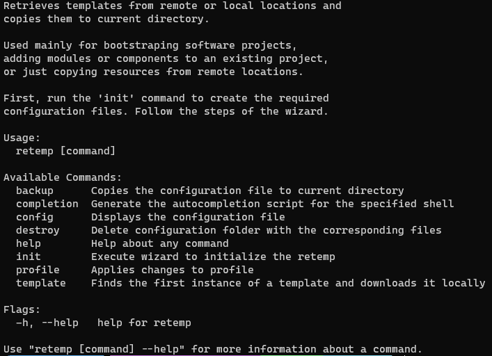
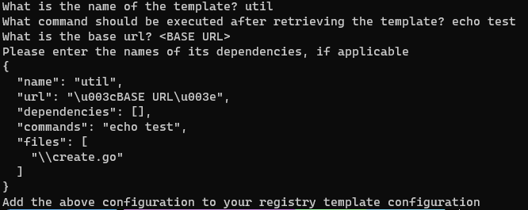

# *go-retrieve*: retrieve templates

[](https://github.com/RomanosTrechlis/go-retrieve/actions?query=workflow%3Abuild)
[](https://github.com/RomanosTrechlis/go-retrieve/actions?query=workflow%3Atests)
[](https://codecov.io/gh/RomanosTrechlis/go-retrieve)
[](https://github.com/RomanosTrechlis/go-retrieve/blob/master/LICENSE)

Retrieves templates from remote or local locations and copies them to current directory.

Used mainly for bootstrapping software projects, adding modules or components to an existing project, 
or just copying resources from remote locations.

## Usage

```shell
go-retrieve -h
```



### Initialization

The first step is to initialize **go-retrieve**. ```go-retrieve init``` will begin a wizard where after answering some
questions a config file will be created in ```~/.go-retrieve``` directory.

```json
{
 "active": {
  "name": "github",
  "sources": [
   {
    "name": "github",
    "url": "<SOME URL>",
    "token": "go-retrieve_TOKEN"
   }
  ]
 },
 "profiles": [
  {
   "name": "github",
   "sources": [
    {
     "name": "github",
     "url": "<SOME URL>",
     "token": "go-retrieve_TOKEN"
    }
   ]
  }
 ]
}
```

In the configuration file it is possible to create several *profile* from which only one can be active at any given moment.

*Profiles* exist for two reasons:

1/ since the retrieval will get the first instance of a template, with different profiles we can have different templates with the same name.
2/ better organization

In every *profile* there is a list of *sources*. Every *source* references a distinct *registry*.

A *registry* contains metadata for the templates it contains.

```json
{
    "name": "github",
    "protocol": 1,
    "templates": [
      {
        "name": "breadcrumb",
        "url": "<BASE URL>",
        "dependencies": [],
        "commands": "yarn add react-router-dom",
        "files": [
          "Breadcrumb.tsx",
          "BreadcrumbItem.tsx"
        ]
      },
      {
        "name": "placeholder",
        "url": "<BASE URL>",
        "dependencies": [],
        "commands": "",
        "files": [
          "Placeholder.tsx"
        ]
      },
      {
        "name": "portlet",
        "url": "<BASE URL>",
        "dependencies": [
          "placeholder"
        ],
        "commands": "",
        "files": [
          "Portlet.tsx"
        ]
      }
    ]
}
```

The following table explains the template format.

|    field     | description                                                                                                                                                                           |
|:------------:|---------------------------------------------------------------------------------------------------------------------------------------------------------------------------------------|
|     name     | This is the name of the template. With this name we can retrieve it from the location it is stored.                                                                                   |
|     url      | This is the **base** URL. **go-retrieve** will download the template using this URL to construct the location of each file.                                                                |
| dependencies | This field is a comma separated string with the names of the templates that this template has a dependency to. The dependencies must exist in the *profile* in order to be retrieved. |
|   commands   | This is a command to execute after the retrieval of the component.                                                                                                                    |
|    files     | This is a list of files that comprise the template. All this files will get downloaded by **go-retrieve**.                                                                                 |


### Template creation

We can create a template using the ```go-retrieve template create <directory>```.
The product of this command will be the json configuration necessary for retrieving the *template*.



### Exploring the configuration

The configuration can be explored with the following commands:

1. ```go-retrieve config``` to display the config file,
2. ```go-retrieve profile list``` to display all available profiles,
3. ```go-retrieve profile inspect <PROFILE NAME>``` to display the configuration of the specified profile,
4. ```go-retrieve template list``` to get a list of active profile's *registered templates*, and 
5. ```go-retrieve template list <template name>``` to display the json configuration of the specified template.

### Template retrieval

Run the ```go-retrieve template <TEMPLATE NAME>``` command to retrieve the specified template.

**go-retrieve** will execute the following steps:

1. find the configuration of the specified template,
2. retrieve dependencies, if they exist,
3. retrieve the specified template,
4. execute the *after retrieval* command

## Example

For a demonstration of **go-retrieve**'s usage see [here](doc/example.md).

## License

This project is distributed under the [MIT License](LICENSE)

## TODO

- [ ] check for template with the same name
- [x] download dependencies first
- [ ] retrieve multiple templates at once
- [ ] re download template definitions when template not found
- [ ] registry commands implemented
- [ ] upload templates (?)
- [ ] add execution of scripts after go-retrieve - single script with the name of after_retrieve.bat/.sh
- [x] allow for specification of the directory for downloaded content
- [ ] check for cyclical dependencies
- [ ] add github actions