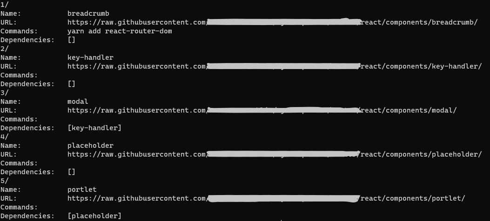

# Example use case

In this example, we use **go-retrieve** to retrieve typescript code templates
for a brand-new React application.

This is not a follow along tutorial, but an actual use case from our daily work
life.

## Initializing the project

We execute the following command to create an empty React typescript project.

```bash
yarn create react-app go-retrieve-example --template typescript
```

After the execution of the command we have the following project structure.


## Retrieving template

We already have initialized **rt** and created the necessary registry
files.

This is the template list configured with **rt**.

```bash
rt template list
```



We execute the following command to retrieve the *breadcrumb* template
component.

```bash
rt template breadcrumb -d src/components
```

The flag *-d* puts the retrieved component to the specific directory.

As we see from the template list, the *breadcrumb* component has an after
retrieval command to execute. The following screenshot displays the output of
the command.


The new project structure is as follows:


We can, clearly, see the *breadcrumb* component in the specified directory
containing the corresponding typescript files.

This component is now ready to use in the React application.

## Component with dependencies

A more complex example is when a component has a dependency on another
component, like the *portlet* typescript component. In this case,
**rt** retrieves the dependencies first before retrieving the requested
component.

```bash
rt template portlet -d src/components
```

Again, we retrieve the *portlet* component to the *src/components* directory. In
the following image we can clearly see that the *placeholder* typescript
component has been retrieved as well.


The *portlet* component is ready to be used.
